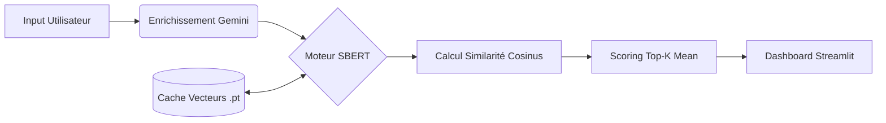

#  AISCA : Assistant Intelligent de Carrière

> **Moteur de recommandation sémantique et coaching carrière par IA Générative.** > *Projet de Mastère Data Engineering & IA - Bloc 2 (RNCP40875)*

##  À propos du projet

**AISCA** (Assistant Intelligent de Carrière) est une application conçue pour résoudre le problème des "faux négatifs" dans le recrutement Tech. Contrairement aux ATS (Applicant Tracking Systems) classiques qui filtrent par mots-clés exacts, AISCA utilise le **NLP (Natural Language Processing)** pour comprendre le sens et la profondeur technique d'un parcours professionnel.

L'outil analyse les expériences d'un candidat, les projette vectoriellement sur un référentiel de compétences Data (120+ skills), et détermine le profil métier idéal (Data Engineer, Data Scientist, etc.) avec un plan de progression généré par IA.

###  Fonctionnalités clés

* **Analyse Sémantique :** Vectorisation des expériences via **SBERT** (Architecture Siamoise) pour détecter les compétences implicites.
* **Scoring Intelligent :** Algorithme **Top-K Mean** pour valoriser l'expertise réelle sans pénaliser la méconnaissance d'outils périphériques.
* **Pipeline ETL Robuste :** Module de chargement sécurisé (`data_loader`) garantissant la qualité et la gouvernance des données (gestion des NaN, nettoyage).
* **Coaching IA (RAG) :** Génération de résumés de profil et de plans d'action personnalisés via l'API **Google Gemini 1.5 Flash**.
* **Optimisation :** Système de **double cache** (Tenseurs .pt et JSON) pour une latence < 1s.

---

## 🛠️ Stack Technique

### Core & Data Engineering

* **Python** : Langage principal.
* **Pandas / NumPy** : Manipulation et agrégation des données.
* **ETL Custom** : Module de nettoyage et normalisation des CSV bruts.

### Intelligence Artificielle (NLP & GenAI)

* **Sentence-Transformers** : Modèle `all-MiniLM-L6-v2` pour les embeddings.
* **PyTorch** : Gestion des tenseurs et calculs GPU/CPU.
* **Google Generative AI** : API pour l'enrichissement sémantique et le RAG.

### Interface & Visualisation

* **Streamlit** : Interface utilisateur interactive.
* **Plotly Express** : Graphiques Radar et Bar Charts interactifs.

---

##  Architecture Simplifiée



##  Installation

1. Cloner le dépôt :

```bash
git clone https://github.com/votre-username/aisca.git
cd aisca

```

2. Installer les dépendances :

```bash
pip install -r requirements.txt

```

3. Configurer l'API Key (créer un fichier `.env`) :

```env
GOOGLE_API_KEY=votre_cle_api_ici

```

4. Lancer l'application :

```bash
streamlit run app.py

```

---

